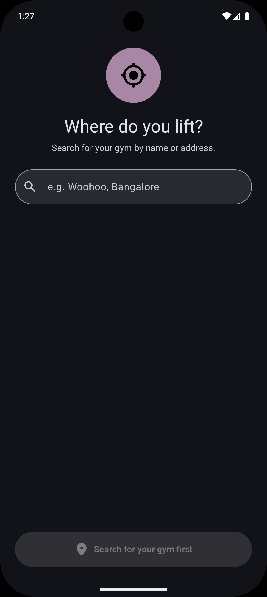
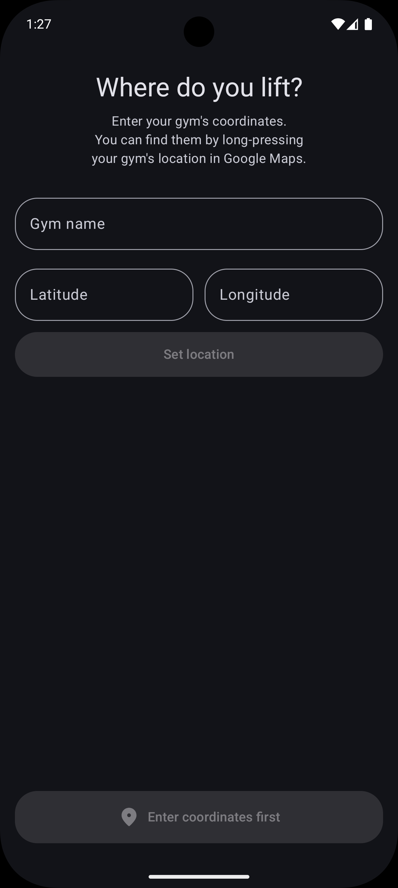
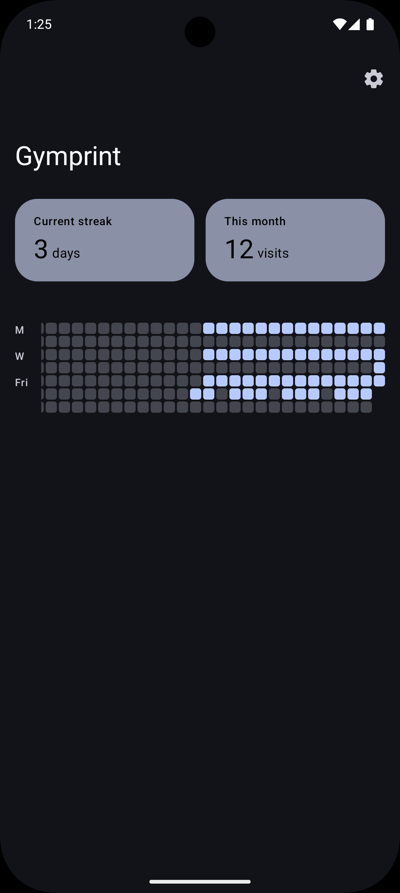
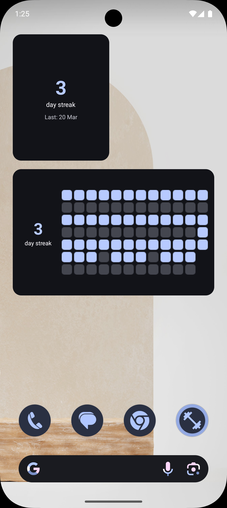

# Gymprint

Automatic gym visit tracker for Android. Set your gym's location once — Gymprint uses geofencing to detect when you visit and logs it automatically. No manual check-ins.

## Screenshots

<p float="left">
  
  
  
  
</p>

## Download

Grab the latest APK from the [Releases](../../releases/latest) page. No API key included — uses manual coordinate entry by default.

## Features

- **Automatic tracking** — geofence-based detection, no manual logging needed
- **Contribution graph** — GitHub-style heatmap of your gym visits over the past year
- **Streak counter** — tracks your current consecutive-day streak
- **Home screen widgets** — small (2x2) streak widget and medium (4x2) streak + graph widget
- **Configurable detection** — adjust geofence radius and minimum visit duration
- **Material You** — dynamic colors on Android 12+, clean Material 3 design

## Setup

### Without a Google Places API key (default)

You don't need an API key to use Gymprint. During onboarding, you'll enter your gym's coordinates manually:

1. Open Google Maps and find your gym
2. Long-press on the gym's location to get coordinates
3. Enter the latitude and longitude in the app

### With a Google Places API key (optional)

If you want the search-based gym picker:

1. Go to [Google Cloud Console](https://console.cloud.google.com)
2. Enable the **Places API (New)**
3. Create an API key
4. Add it to `local.properties`:
   ```
   MAPS_API_KEY=your_key_here
   ```

The search UI will automatically be available when the key is present at build time.

## Building

```bash
git clone https://github.com/theminimaldev/gymprint.git
cd gymprint
./gradlew assembleDebug
```

Requires Android 8.0+ (API 26). No root or special setup needed.

The APK will be at `app/build/outputs/apk/debug/app-debug.apk`.

### Release builds (CI)

Releases are built automatically on GitHub Actions when a tag is pushed:

```bash
git tag v1.0.0
git push origin v1.0.0
```

The workflow signs the APK using secrets stored in the repository (`SIGNING_KEY`, `KEY_STORE_PASSWORD`, `KEY_ALIAS`, `KEY_PASSWORD`) and publishes it to GitHub Releases.

## Tech Stack

- Kotlin + Jetpack Compose (Material 3)
- Hilt for dependency injection
- Room for local database
- DataStore for preferences
- GeofencingClient for visit detection
- Jetpack Glance for home screen widgets
- WorkManager for periodic widget refresh
- Google Places SDK (optional, for gym search)

## Permissions

- **Location (fine + background)** — required for geofence detection
- **Internet** — only used if Places API key is configured
- **Boot completed** — re-registers geofence after device restart

## How It Works

1. You set your gym's location (coordinates or search)
2. Gymprint registers a geofence around that location
3. When you enter the geofence, it records the timestamp
4. When you leave, if the visit exceeded the minimum duration, it logs the visit
5. Widgets and the contribution graph update automatically

## License

MIT
